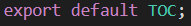

# React (생활코딩)

## Intro

#### 공부 전략

- 전체를 훑는게 아니고 처음, 중간, 끝만
- 처음 (코딩) -> 중간 (실행) -> 끝(배포)

<br/>

#### 개발환경 세팅

1. npm 설치
   - `nodejs.org`에서 LTS 버전 설치
   - npm 관련 (`seomal.org` 참고: npm을 다루는 기본적인 방법)
2. `npm install -g create-react-app` 명령으로 설치
   - 공식문서에는 `npx create-react-app` 으로 설치하라고 함.
   - npx는 npm과 다르게 실행할 때 마다 설치한다는 뜻임.(사용할 때 마다 최신 버전을 사용할 수 있음)
3. create-react-app을 이용해서 개발환경 구축 (리액트 앱 만들기)
   - 디렉토리 하나 생성하고, 그 안에 들어가서 `create-react-app .`
   - 배쉬로 해도 되고, vscode 열어서 해도됨.
4. `npm run start` or `npm start `로 실행 가능

※ 만약, create-react-app으로 만들었을때, App.js 파일이 함수 형태로 되어 있을 경우 class 형태로 바꿔준다

```react
// react라고 하는 라이브러리에서 Component라고 하는 클래스를 로딩. React는 꼭 필수적으로 넣어줘야하는것.
import React, { Component } from 'react';
import './App.css';

// App이라는 클래스를 만들고, react의 Component라고 하는 클래스를 상속해서 새로운 클래스를 만든다
// 즉 App이라는 컴포넌트를 만들겠다!
class App extends Component {
  // 그 클래스는 render라는 메서드(함수)를 가지고 있다.
  // class 안에 들어있는 함수는 function 키워드 생략 가능
  render() {
    return (
      <div className="App">
        Hello, React!!
      </div>
    );
  }
}
// 외부에서 사용할 수 있도록
export default App;
```


#### JavaScript 코딩하는 법

- 디렉토리 설명
  - public : index.html 파일이 있는곳
    - `npm runs start`를 했을 때 파일을 찾는 document 루트임.
    - index.html 파일에서, id="root" 부분 중요. 컴포넌트들은 그 태그 안에 들어가게 됨.
  - src : id = "root" 태그 안에 들어가는 컴포넌트들을 작성하는 디렉토리.
    - 진입 파일(entry file) : index.js
      - document.getElementById('root') 를 기반으로 index.html 파일
      - `import App from './App'` 과 ReactDom.render(<App/>)에서 나오는 App 이름은 동일해야함.

- 반드시 하나의 태그 안쪽에 나머지 태그가 있어야함 (vue의 template 작성하는 것과 동일함.)


#### CSS 코딩하는 법

- index.js 파일에 보면 `import './index.css';`라는 부분이 있음
- index.css에 이제 작성하면 자동으로 적용이 될 것임.


## 배포하는 법

#### 빌드

- 빌드 : `npm run build` 명령 실행하면 build라는 파일이 생성됨!
- build 파일에서 공백과 같이 불필요한 정보들을 싹 없앤 index.html 파일 확인 가능.
- 실제 서비스 할 때는 build 안에 있는 파일들을 사용해야함.
- 웹서버의 document root. 즉 웹서버가 문서를 찾는 최상위 디렉토리에다가 build 디렉토리 안쪽에 있는 파일들을 위치시키면 됨.
- 그럼 실 서버 환경이 완성 된 것.


#### 간단히 해보기

- `npm install -g serve` or `npx serve -s build`
  - npm을 통해 설치할 수 있는 간단한 웹 서버
  - npx로 실행하면 한번만 


## 코딩하는 법

#### 컴포넌트 만들기

- App.js에서 클래스로 컴포넌트 생성한다.

```react
class TOC extends Component {
  render(){
    return (
      <nav>
        <ul>
          <li><a href="1.html">HTML</a></li>
          <li><a href="2.html">CSS</a></li>
          <li><a href="3.html">JavaScript</a></li>
        </ul>
      </nav>
    );
  }
}
```

- 이후 App 컴포넌트(최상위 컴포넌트, 실제 코딩할때는 상위 컴포넌트가 될 것)

```react
class App extends Component {
  render() {
    return (
      <div className="App">
        <Subject></Subject>
        <TOC></TOC>
        <Content></Content>
      </div>
    );
  }
}
export default App;
```


#### ★props★ 

- `{this.props.name}`으로 컴포넌트의 속성을 표현할 수 있음

- 위의 코드를 좀 더 깔끔하게 정리하려면 아래처럼 다시 정리할 수 있다.
- 더 효율적이다. 

```react
class Subject extends Component {
  render() {
    return (
      <header>
        <h1>{this.props.title}</h1>
        {this.props.sub}
      </header>
    );
  }
}

class App extends Component {
  render() {
    return (
      <div className="App">
            {/* title, sub를 값을 바꿔줌으로써, 컴포넌트를 다시 따로 만들지 않아도 됨. 즉 재사용성이 높아짐. */}
        <Subject title="WEB" sub="world wide web!"></Subject>
        <Subject title="React" sub="For UI"></Subject>
        <TOC></TOC>
        <Content title="HTML" desc="HTML is HyperText Markup Language"></Content>
      </div>
    );
  }
}
```


#### Component 파일로 분리하기

- App.js에서 한꺼번에 작성했던 컴포넌트들을 파일로 잘라서 사용하면, 더 깔끔하게 코딩할 수 있다.

| 디렉토리에 js파일 생성                                       | 각 js 파일에서 export                                        | 상위 컴포넌트에서 import                                     |
| ------------------------------------------------------------ | ------------------------------------------------------------ | ------------------------------------------------------------ |
| .assets/image-20210828222729185.png) |  | .assets/image-20210828222813964.png) |

- 주의 할 점
  - 컴포넌트들을 js파일로 생성시, `import React, { Component } from 'react';` 필수.
- 컴포넌트.js 파일 구조

.assets/image-20210828223024897.png)


#### State

- props : 사용자가 컴포넌트를 사용하는 입장에서 중요한 정보
  - 함수 매개변수처럼 컴포넌트에 전달됨.
- state : props 값에 따라서 컴포넌트 내부의 구현에 필요한 데이터들
  - 함수 내에 선언된 변수처럼 컴포넌트 안에서 관리됨.
- 왜 이렇게 구분할까? 사용하는 쪽과 구현하는 쪽을 철저하게 분리시켜서 양쪽의 편의성을 각자 도모하기 위함.
- 사장과 직원개념으로 비유하면 사장=state, 직원=props로 사장이 일 목록을 만들면 직원은 목록에 있는 것을 골라서 일을 처리할 수 있지만 직원이 새로운 일을 하려면 기획안(이벤트)을 만들어 사장에게 허락을 구하는 것

.assets/image-20210828223441308.png)

| state 사용전(props로 했을때)                                 | state 사용후                                                 |
| ------------------------------------------------------------ | ------------------------------------------------------------ |
| .assets/image-20210828224115516.png) | .assets/image-20210828224235539.png) |

- 컴포넌트에서 내부적으로 사용할 상태는 state를 사용해서 관리한다.
- 상위 컴포넌트에서 state값을 하위컴포넌트의 props로 전달 가능!

- 그럼 state는 어떻게 정의할까?

```react
class App extends Component 

  constructor(props){
    super(props);
    this.state = {
      subject:{title:'Web', sub:'world wide web!'}
    }
  }

  render() {
    return (
      <div className="App">
        <Subject title={this.state.subject.title} sub={this.state.subject.sub}></Subject>
        <TOC></TOC>
        <Content title="HI" desc="HTML is HyperText Markup Language"></Content>
      </div>
    );
  }
}
export default App;
```

- 컴포넌트가 실행될 때, render라는 함수가 실행되기 이전에 컴포넌트를 초기화 시켜 주고 싶은 코드는 constructor를 짜고, 그 안에다 작성. 개인적인 생각으로 created, mounted같은 라이프사이클이라고 이해하면 될 듯.


#### key

- 부모에서는 state라고 하는 내부정보를 사용하고, 자식에게 그 정보를 전달할때는 props로 전달

- 먼저, li태그를 하드코딩하지말고, state를 활용하여 정리해보자

| 정리 전                                                      | 정리 후                                                      |
| ------------------------------------------------------------ | ------------------------------------------------------------ |
| .assets/image-20210828225553124.png) | .assets/image-20210828225636182.png)<br />.assets/image-20210828225649879.png)<br /><br />.assets/image-20210828225538283.png) |

- 주의할 점은, 위와같이 element 여러개를 자동으로 생성하는 경우 key값을 설정해 줘야함 (vue에서 for문 사용해서 태그 생성할때 key값 설정한 것과 같음.)
  - `lists.push(<li key={data[i].id}><a href={"/content/" + data[i].id}>{data[i].title}</a></li>)`


#### 이벤트

- 어떤 이벤트를 통해, state값을 바꾸어 props로 내려보내는 값을 바꾸어 동적 페이지를 작성할 수 있다. 
- state가 바뀌면, 그 state를 가지고 있는 컴포넌트의 render 함수가 다시 호출되고, 하위 컴포넌트들의 render도 다시 호출됨. 즉 화면이 다시 그려짐.
- ex) 태그 안에 `onClick={}`을 쓰면 클릭했을때의 이벤트. 대괄호 안에 function 쓰면 그 함수 실행됨.  
  - `<a href="/" onClick={function(){ alert('hi');}}>` => a 태그 클릭하면 경고창 띄움
    - 참고) a태그 내에서, function(e)로 하고 e.preventDefault() 해주면 페이지 이동 발생하지 않음. (기본적인 동작을 막는 방법)

- **State 변경하기**

  - 이벤트 function 내에서 `this.setState({ mode: 'welcome' });` 처럼 쓰면 현재 컴포넌트의 state를 변경할 수 있다. 동적으로 변경할때는 꼭 setState로 변경할 것! `this.state.mode = 'welcome'` <- 이렇게 쓰면 리액트가 바뀐걸 모름.

    - vue랑 다른 부분.

  - but, 그냥 쓰면 this 가 무엇인지 모르기 때문에 에러가 발생한다. 따라서 함수 뒤에 `.bind(this)`를 붙여준다. 바인딩을 통해 this를 묶어주는것이라고 보면 됨. this는 컴포넌트 자신임.

    - ex)  onClick={function(e){

      ​      e.preventDefault()

      ​      this.state.mode = 'welcome';

      ​     }.bind(this)}

    - this가 없을때 this 강제 주입!

- **이벤트 만들기**

  - 상위컴포넌트에서 선언한 하위 컴포넌트 태그 안에, `onChangePage={}`와 같이 이벤트를 만들어서, 클릭이 발생했을때의 동작을 정의할 수 있음.

  - 하위 컴포넌트로는 props로 전달되기 때문에, 하위 컴포넌트 정의문 안에는 `onClick={}`로 처리할 수 있음.

  - 정리하면

  - | 상위 컴포넌트                                                | 하위 컴포넌트                                                |
    | ------------------------------------------------------------ | ------------------------------------------------------------ |
    | .assets/image-20210829021256189.png)<br /> 2. onChangePage 함수가 호출되면, setState로 state를 변경한다! | .assets/image-20210829021321638.png)<br />1. onClick 이벤트가 발생하면, props로 전달된 onChangePage 함수를 호출한다! |

  - 참고 : 클릭했을떄 나오는 event 객체의 target에는 다양한 정보가 있는데, 만약 a태그 안에 `data-id = {data[i].id}` 라는 속성을 넣어주면, `-` 를 기준으로 data라는 접두사때문에 event.target.dataset으로 접근할 수 있고, id라는 접미사 때문에 event.target.dataset.id로 접근할 수 있다.

  - 정리 : 
    - 데이터 전달 : 상위 컴포넌트 > props > 하위 컴포넌트 
    - 하위 컴포넌트 > 이벤트 실행 > 상위 컴포넌트의 state 호출 > state 값 수정
    - props는 수정 불가능 (read-only) 


#### Create 구현


#### React Developer Tools

- `https://reactjs.org/tutorial/tutorial.html#developer-tools`
- 설치 후 개발자 도구 열고 상위 탭에 react 클릭하면
- 우리가 만든 앱의 컴포넌트들을 볼 수 있음.