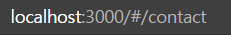

# React-Router

#### 설치

```bash
npm install react-router-dom
```

## Router

#### BrowserRouter

- 사용하는 js 파일 내에서 `import {BrowserRouter} from 'react-router-dom'` 
- react-router-dom을 적용하고 싶은 컴포넌트의 최상위 컴포넌트에 감싸주는 wrapper component
- 즉, 여기서는 App이 최상위 컴포넌트 이므로 `ReactDOM.render(<App />, document.getElementById('root'))`를  `ReactDOM.render(<BrowserRouter><App /></BrowserRouter>, document.getElementById('root'))` 로 만들어준다.
- 그러면 App이라고 하는 컴포넌트 안에서는 BrowserRouter를 사용할 수 있는 상태가 된 것임.


#### Route

- 사용하는 js 파일 내에서  `import {BrowserRouter, Route} from 'react-router-dom'`

  -  BrowserRouter는 안써도 됨 (최상위가 아닐 시)

- 라우터로 만들고 싶은 컴포넌트를 감싸주면 됨.

  - | 전                                                           | 후                                                           |
    | ------------------------------------------------------------ | ------------------------------------------------------------ |
    |  |  |

  - 감싸주기만 하면 되나? 아니다. path 설정해 줘야함. `<Route path="/"><Home></Home></Route>`처럼..

- 자, 이제 아래 예제를 한번 보자

  - 

  - 여기서, li태그 중 Home 버튼을 클릭하면 이동하는 주소에 따라 라우팅 되는 컴포넌트가 다르게 된다.
  - 

  - 근데 좀 이상하다. 왜 `/topics`로 이동했는데 Home 컴포넌트가 나오는 것일까?
  - path가 `/`에도 걸리기 때문이다!
  - 따라서 exact라는 속성을 추가함으로써 정확한 값만 걸리게 만들어 줄 수 있다.

- 나중에 컴포넌트가 굉장히 복잡해지고 깊어질 경우에도, Route path만 지정해준다면 그 컴포넌트는 그 주소와 매칭되는 애만 화면에 표시될 것임.

- 어디에 있건, 누구건 화면에 출력된다! (동적 라우팅)


## Switch

- exact를 쓰지 않고도 exact를 쓴것과 같은 효과를 낼 수 있음.

- `import {BrowserRouter, Route, Switch} from 'react-router-dom'`로 import 시키고 Route 컴포넌트들을 Switch라는 컴포넌트로 감싸주면 됨.

- 단, 여기서 Switch 컴포넌트는, url이 입력되었을때 Switch 컴포넌트 안에 있는 애들 중 일치하는것을 발견하게 되면 나머지는 읽지 않고 버린다. 즉, 제일 먼저 걸리는 애만 출력됨.

- 따라서 다음과 같이 사용할 수 있음.

  - | exact 사용 x                                                 | exact 사용 o                                                 |
    | ------------------------------------------------------------ | ------------------------------------------------------------ |
    |  |  |

- 404 (page not found) 페이지도 쉽게 구현할 수 있다.

  - 

 

## Link

- 라우터를 페이지 reload 없이 처리하는 방법.
- `import {BrowserRouter, Route, Switch, Link} from 'react-router-dom'` 로 가져온다.

- 기존에 a태그로 만들었던 url 설정 부분을, Link 컴포넌트로 대체하고, href 대신 to를 사용한다.
- 이렇게 만들면, 페이지가 바뀌지 않게끔 할 수 있다 (새로고침 일어나지 않음.)
- 아래와 같이 사용
  - 


## HashRouter

- 위에서 사용했던 BrowserRouter 대신 HashRouter를 교체하여 사용해 본다.
- 그러면 아래처럼 주소가 바뀜
  - 

- 웹 서버 설정을 바꿔서 어떤 path로 들어오건 간에 Route 페이지에 있는 html 파일을 서비스 할 수 있다면 BrowserRouter를 사용하면 됨.
- 그게 안된다면 HashRouter를 사용함.


## NavLink

- Link와 유사한 기능인데 좀 더 기능적으로 추가 됨.

- `import {BrowserRouter, Route, Switch, Link, NavLink} from 'react-router-dom'` 로 import 시키고, Link로 처리했던 부분을 NavLink로 바꿔서 진행해 본다.

- 이렇게 바꾸었을때, 해당 태그를 클릭하면 개발자 도구의 Elements 창에는 a태그의 class="active"로 표시됨. 

- 근데, 그냥 이대로만 썼을때 Route를 쓰는 경우처럼 경로가 중복되어 걸리는 경우 class="active"가 중복되어 표시된다. 따라서, 여기도 속성값으로 exact를 줄 수 있다.

- 이걸 활용해서, 사용자가 현재 어떤 페이지에 위치하고 있는지 직관적으로 이해할 수 있게 네비게이션에 사용자가 위치하고 있는 곳을 표시해 줄 수 있음. (index.css 파일 활용)

  - | 코드                                                         | 실제 적용                                                    |
    | ------------------------------------------------------------ | ------------------------------------------------------------ |
    |  |  |


## Nested Routing

- 주소로 파라미터 넘기기.

- 글의 id 값에 따라 다르게 보여줘야하는 경우, 글이 많을 때는 일일이 하나씩 주소를 만들어 주는것 보다 파라미터로 값을 넘겨 간단하게 코드를 짜는 것이 좋다.

  - | 파라미터 안쓸시                                              | 파라미터 쓸 시                                               |
    | ------------------------------------------------------------ | ------------------------------------------------------------ |
    |  |  |

- useParams : 파라미터를 사용하여 route를 설정한 경우, Route 설정이 되어 있는 Component 안에서는 useParams() 함수를 통해 그 파라미터의 정보를 확인할 수 있다. 이를 통해, 동적으로 활용할 수 있다.

  - 


#### 참고) ServerRendering

- 우리가 만든 어플리케이션은 자바스크립트로 동적으로 만들어 지는 어플리케이션임.
- 검색 엔진과 같은 기능들은 정적인 HTML이 없으면 처리할 수 없거나 어려움.
-  Server side Rendering을 이용하게 되면 우리가 만들 웹 페이지를 서버쪽에서 node.js 같은 기술로 생성해서 최종적으로 정적인 HTML로 만들어줌.

#### 참고2) Code Spliting

- 우리가 만든 어플리케이션의 페이지가 많아진다면, 용량이 커진다.
- 페이지, 컴포넌트를 적당히 쪼개서 필요할 때마다 load 하게 할 수 있다면 성능이 높아질 것임.
- 원하는 대로 컴포넌트를 쪼개는 기능


#### 참고

https://reactrouter.com/web/guides/quick-start