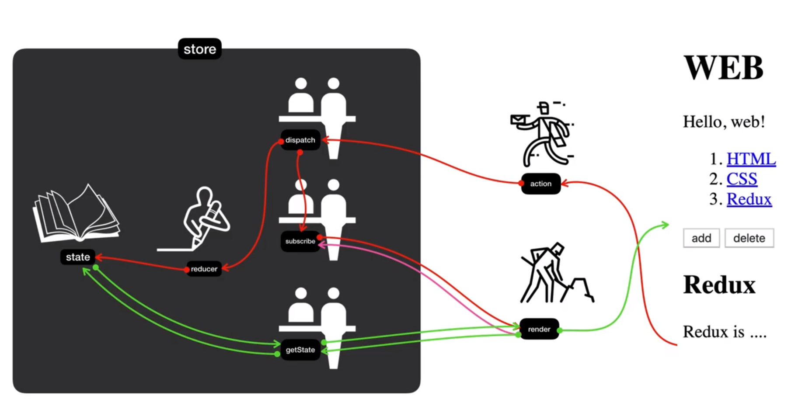
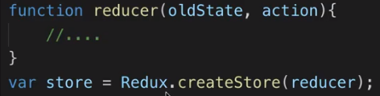
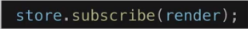
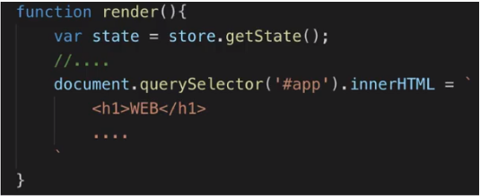
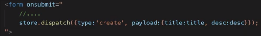
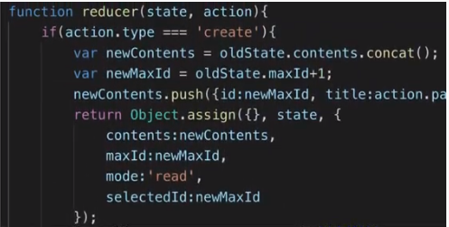
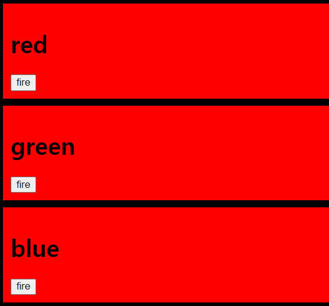
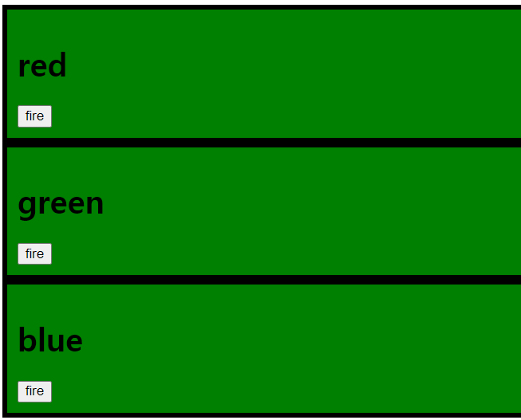
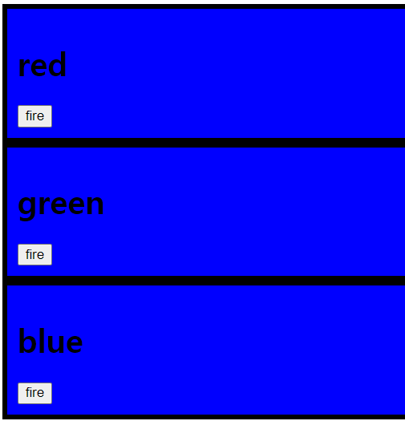
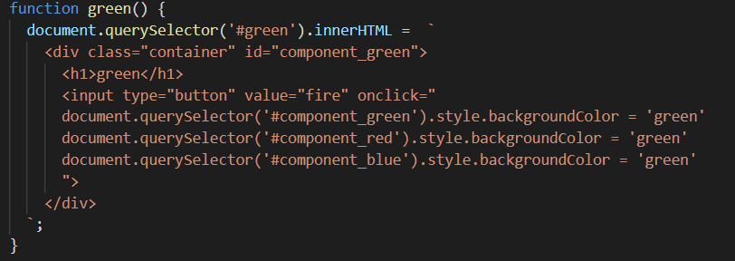

# Redux

> 자바스크립트로 만든 어플리케이션들을 위한 예측가능한 상태의 저장소
>
> UNDO, REDO를 쉽게 할 수 있다.

- Redux를 활용해 애플리케이션의 상태를 이전보다 훨씬 예측가능하도록 만들어 본다.
- CRUD 구현을 통해 Redux를 이해해 본다.
- 실습 지도


#### state와 render의 관계

- 리덕스의 핵심은 store
  - store : 정보가 저장되는 곳. 
- store 안에는 state, reducer,dispatch,subscribe, getState 를 정의 
  - 직접적으로 state를 변경하지 않는다!
  - reducer라는 함수를 만들어 공급한다!
    - ex) 
    - reducer를 만드는게 redux를 만드는 일이라고 할 정도로 중요.
  - getState : store에 있는 state 값을 가져오는것.
  - dispatch : store에 있는 state를 변경.
  - subscriber : State값이 바뀔때 마다 UI가 갱신될 수 있도록 할 때 사용. state값이 바뀔때 마다 render 함수를 호출해 UI를 갱신할 수 있음
    - ex) 
- redux와는 상관없이 UI를 만들어 주는 render를 활용한다. (store 안에 있는것 x)
  - ex) 


#### action과 reducer

- 만약 예를들어, 새로운 글을 작성한다라고 가정해 보자.
- submit 버튼이 존재할 것이고, 그 submit 버튼에는 아래와 같이 이벤트를 작성할 수 있다.
  - 

- dispatch 안에 들어가는 객체는 action이라고 하며, 이 action이 dispatch에게 전달된다
- dispatch는 2가지 일을 함
  - reducer를 호출하여 state 값을 바꿈
  - 그 작업이 끝나면 subscribe를 이용해서 render 함수를 호출한다. (화면이 갱신됨)
- dispatch가 reducer를 호출할 때 2개의 값을 전달한다.
  - 1. 현재의 state값
  - 2. action 데이터 (객체)
  - 
- 즉 reducer는 state를 입력값으로 받고, action을 참조해서 새로운 state값을 만들어 내서 return해줌. (state를 가공하는 가공자)
- state가 변경되면, dispatch가 subscribe에 등록되어있는 놈들을 다 호출 -> render 호출 -> getState로 다시 화면이 갱신됨.


#### Redux를 사용하지 않는다면?

> Redux를 사용하지 않고 어떤 버튼을 클릭하여 다른 부분의 상태를 바꾸는 코드를 짜보자.

| 빨간버튼 클릭시                                              | 초록버튼 클릭시                                              | 파란버튼 클릭시                                              |
| ------------------------------------------------------------ | ------------------------------------------------------------ | ------------------------------------------------------------ |
|  |  |  |

- 위와 같이 반응하도록 코드를 만들기 위해, 아래와 같은 코드를 작성하였다.
  - 

- 즉, Redux를 사용하지 않고 다른 부분의 상태 변경도 관리하기 위해서는 위 코드처럼 일일이 하나하나 추가해 주어야 한다. 즉, 함께 관리해야하는 부분이 늘어날수록 코드량이 매우 많아질 것이다.


#### Redux 적용 - store 생성

> redux 공식 사이트 : https://redux.js.org/

- Redux 설치방법

  - `npm install --save redux`
  - 혹은 cdn으로도 활용 가능하다.  https://cdnjs.com/libraries/redux 참고. <- 실습에서 활용한 방법

- Store 만들기. (cdn 방식)

  - html 파일의 head 태그 내에 script 태그에 url을 넣어준다.

  - cdn 방법으로 Redux를 사용할 때, html 파일의 body의 script 태그 안에 `Redux.createStore()`를 선언. createStore()의 입력값으로는 reducer가 들어감.

  - 따라서 reducer라는 이름을 가진 함수를 만들어 입력값으로 넣어줄 것임.

    - reducer : action이 들어오면 action값과 기존의 state값을 참고하여 새로운 state값을 만들어 주는 역할

  - 아래와 같이 코드를 작성해 볼수 있음.

  - ```react
    function reducer(state, action){
            // state 값이 정의되지 않은 초기 상태라면. 즉 초기상태라면
            if (state === undefined){
              return { color:"yellow" }
            }
          }
          // store가 store 라는 전역변수에 저장이됨. 즉 이러면 애플리케이션 어디서든 실행할 수 있는 코드가 됨.
          // 위와 같이 state 초기값에 대해 설정해 주면 store에는 state의 초기값이 저장이 되는 것임.
          var store = Redux.createStore(reducer);
    
          // 확인하기 위해
          console.log(store.getState());
    
          function red() {
            // state를 불러와서, ${} 문법으로 활용 가능하다.
            var state = store.getState()
            document.querySelector('#red').innerHTML =  `
              <div class="container" id="component_red" style="background-color=${state.color}">
                <h1>red</h1>
                <input type="button" value="fire" onclick="
                document.querySelector('#component_red').style.backgroundColor = 'red'
                document.querySelector('#component_green').style.backgroundColor = 'red'
                document.querySelector('#component_blue').style.backgroundColor = 'red'
                ">
              </div>
            `;
          }
    ```


#### Redux 적용 - reducer와 action을 이용하여 새로운 state값 만들기

- store.dispatch를 사용하여 state 값을 변경할 수 있다.

  -  사용시 객체(action)를 넘기고, 그 객체에는 type을 무조건 선언해야함.

  - ```react
    <div class="container" id="component_red" style="background-color=${state.color}">
        <h1>red</h1>
        <input type="button" value="fire" onclick="store.dispatch({type:'CHANGE_COLOR', color: 'red'});">
    </div>
    ```

  - dispatch는 state를 생성할때 사용한 reducer 함수를 호출하도록 약속되어 있음. 이때 이전의 state값과, 전달된 action의 값을 인자로 줌.

- 정리하면, reducer는 action 값과 이전의 state값을 이용해  새로운 state값을 return해주면, return된 값이 새로운 state 값이 된다. 또한 return된 값은 원본을 바꾸는 것이 아니라, 이전에 있었던 값을 복제한 결과를 return한 값으로 이용해야만  redux를 충분히 활용할 수 있다.

- ```react
  function reducer(state, action){
          // state 값이 정의되지 않은 초기 상태라면. 즉 초기상태라면
          if (state === undefined){
            return { color:"yellow" }
          }
          var newState
          if (action.type==="CHANGE_COLOR") {
            // state의 프로퍼티들이 복제되어 newState 변수에 들어감.
            newState = Object.assign({}, state, {color:'red'})
          }
          return newState
        }
  ```


#### Redux 적용 - State의 변화에 따라 UI 반영하기 

> store(중앙모임state), dispatch => 변경되었다는 걸 알림 => reducer함수 호출 => reducer는 state와 action을 파라미터로 받음 => 기존의 state를 직접 변경하지않고 immutable을 위해 새로운 객체를 만들어 return 함 => state 변경. view는 state가 바뀔때마다 변경되어야 함으로 subscribe함수를 변경되는 부분마다 걸어줌 => subscribe를 걸어주면 해당부분이 바뀔때마다 render를 호출하여 화면을  바꿈

- State 값이 바뀔때마다 (dispatch를 할 때 마다) 함수가 호출 되게 하기 위해서는 subscibe에 render를 등록해 놓으면 됨. (dispatch가 state를 변경하고 나면 subscribe를 호출하게 약속되어 있음)

  - ```react
    function red() {
            // state를 불러와서, ${} 문법으로 활용 가능하다.
            var state = store.getState()
            
            // store.dispatch 사용시, 객체를 넘기고, 그 객체에는 type을 무조건 선언해야함.
            document.querySelector('#red').innerHTML =  `
              <div class="container" id="component_red" style="background-color=${state.color}">
                <h1>red</h1>
                
                <input type="button" value="fire" onclick="
                  store.dispatch({type:'CHANGE_COLOR', color: 'red'});
                ">
              </div>
            `;
          }
    store.subscribe(red)
    red();
    ```


#### 시간 여행과 로깅

- redux devtools 사용 해보기

  - 구글 웹 스토어에서 Redux DevTools 설치.

  - store에 전달된 action들을 버전관리 하는것이라 보면 됨. (이전버전과 이후 버전 차이를 쉽게 확인할 수 있음)

  - 사용하기 위해서는 아래와 같이 store 생성시 추가적으로 내용을 넣어줘야함.

  - ```react
    var store = Redux.createStore(
            reducer,
            window.__REDUX_DEVTOOLS_EXTENSION__ && window.__REDUX_DEVTOOLS_EXTENSION__()
            );
    ```

  - 참고 : https://github.com/zalmoxisus/redux-devtools-extension


#### 실전 Rdux : 정적인 웹페이지 만들기.
